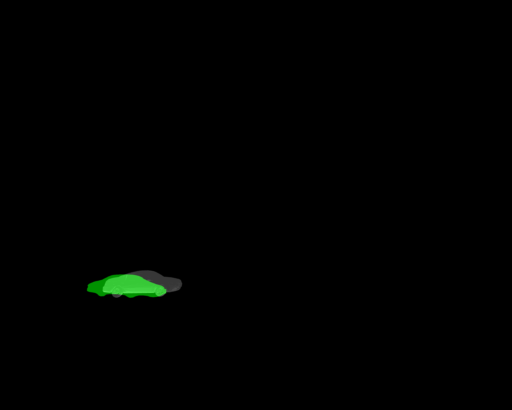
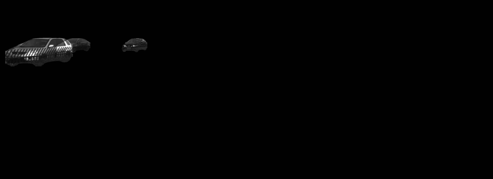
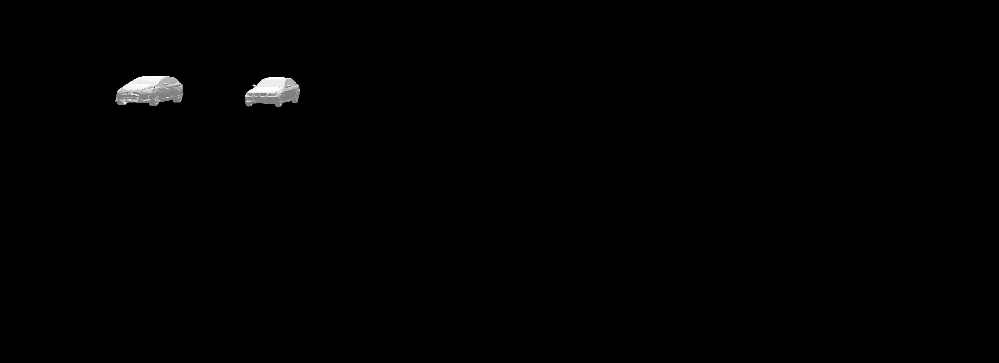

# Neural Mesh Renderer for lighting

## Why we need to learn lighting?

Because if only use silhouette to learn Rotation (R) and Translation (T), 
we observe that the NMR will mostly will use Rotation to minimise the silhouette 
IoU loss. See the example below (green is the ground truth mask):



Hence, we need grayscale information as a stronger supervision.
But since we don't have the color and texture information for the vehicles, we can only utilise the mesh information.
And the direction and intensity of the lighting is important.

## Lighting

Lighting can be applied directly to a mesh. In NMR, there are ambient light

be the  intensities of the ambient light and 

directional light, respectively, 

be a unit vector indicating the direction of the directional light, and

be the normal vector of a surface.
The modified color of a pixel 

.

In the NMR formulation, gradients also flow into the intensities 
as well as the direction of the directional light.
Therefore, light sources can also be included as an optimisation target.


### Learning ambient light intensity, directional light intensity and directional light 
 
 Given the following masked grayscale image, the lighting could be learnt.
 To save the GPU memory, we only rendered the cropped bottom part of the image and modify the camera intrinsics as :
```
camera_matrix[1, 2] -= 1480   # Because we have only bottom half
```

Because we render the RGB image, 2 cars will consume around ~8G GPU memory (wow!). 
So we can use two cars for one image to have a more liable update. 
The loss can simply be the grayscale difference between the ground truth masked image and the rendered mesh with lighting.

 




